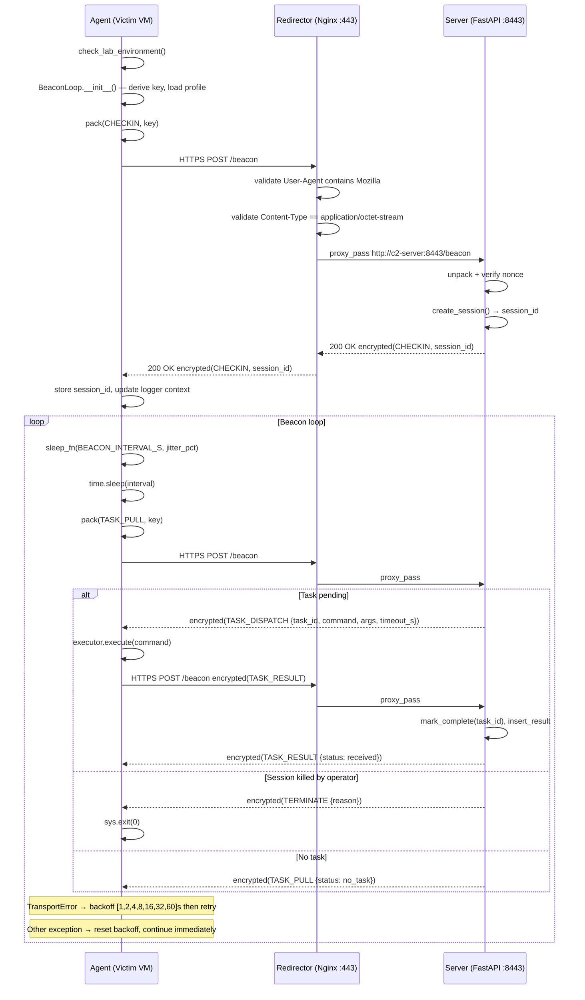
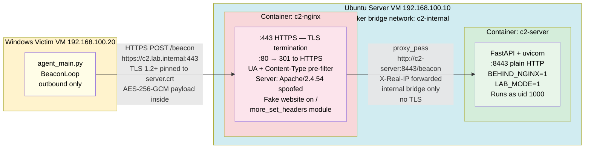

# C2 Simulation Framework

---

> **ACADEMIC NOTICE**
>
> This repository contains a simulated Command and Control (C2) framework created
> exclusively for academic research and controlled laboratory study. All code,
> configurations, and artefacts within this repository are designed to operate
> **only** within an isolated, air-gapped lab network as defined in
> `setup/lab_topology.md`. Deployment outside this boundary is a violation of the
> project SOP and may constitute unlawful computer access under applicable law.
>
> This project MUST NOT be used against any system, network, or device that is not
> owned by the researcher or for which explicit written authorisation has not been
> obtained. The authors accept no liability for misuse.

---

## Project Overview

This project is a research-grade Command and Control simulation framework built to explore how a pull-based implant communicates with a controller under realistic network conditions, and to generate labelled network telemetry suitable for future machine-learning–based Network Intrusion Detection System (NIDS) research. It implements the complete implant-to-controller lifecycle: initial check-in, task dispatch, result collection, and clean termination — all over an AES-256-GCM encrypted, TLS-wrapped channel routed through an Nginx reverse proxy acting as a redirector.

The framework demonstrates three network-layer evasion techniques — sleep jitter, traffic padding, and HTTP header randomisation — and measures their effect on flow-level features (inter-arrival time, payload size, Shannon entropy). Each technique is implemented as a configurable, independently testable module and evaluated against a fixed control condition (baseline profile). The resulting telemetry pipeline, from live PCAP capture through per-flow feature extraction, is designed to produce a labelled dataset for a planned Blue Team machine-learning detection project. All agent operations are hard-gated to the lab network: the implant refuses to start, connect, or execute commands outside the defined environment.

---

## Architecture

The framework is composed of five layers: Agent, Server, Transport, Evasion, and Telemetry. The Agent (Windows VM) beacons outbound through an Nginx Redirector to the FastAPI Server (Ubuntu VM). The entire protocol is encrypted at the application layer (AES-256-GCM) independently of the outer TLS session that Nginx terminates.

### Beacon Cycle Sequence



### Network Topology (Docker — Recommended)



---

## Evasion Layer

The evasion layer (`evasion/`) is a configurable pipeline of three independent techniques, each governed by a named profile in `evasion/profile_config.yaml`. The active profile (`active_profile` key) is loaded at beacon startup via `transport/traffic_profile.py`. Four profiles are defined: **baseline**, **low**, **medium** (default), and **high**.

| Technique | Module | Research Purpose |
|---|---|---|
| **Sleep Jitter** | `evasion/sleep_strat.py` | Randomises inter-beacon intervals using uniform or gaussian distributions to defeat fixed-threshold timing detectors. The `gaussian` strategy (high profile, σ=40%) produces occasional large deviations that break periodicity assumptions. |
| **Traffic Padding** | `evasion/padding_strat.py` | Prepends a 2-byte length prefix and appends 0–256 random bytes before AES-GCM encryption. Goal: disrupt packet-size–based signatures. TLS record framing partially obscures small padding differences at this payload scale. |
| **Header Randomisation** | `evasion/header_randomizer.py` | Rotates four levels of HTTP header pool complexity — from fixed headers only (level 0) to full shuffle with randomised `User-Agent`, `Accept-Language`, `Accept-Encoding`, and randomised insertion order (level 3). `Host` and `Content-Type` are always first and fixed to pass Nginx pre-filtering. |

---

## Experiment Results

Experiments were run with `BEACON_INTERVAL_S=5s` over a 180-second capture window (~35 beacons per profile). Traffic was captured on the loopback interface (`lo`); IAT variance ratios between profiles are valid but absolute timing values are not representative of a two-machine deployment.

### Feature Statistics by Profile

| Profile | beacon_iat mean (s) | beacon_iat std (s) | entropy mean | entropy std | payload mean (B) | payload std (B) |
|---------|--------------------|--------------------|-------------|------------|-----------------|----------------|
| baseline | 5.0983 | 0.0318 | 2.1811 | 0.1242 | 345.2063 | 158.3464 |
| low | 5.0708 | 0.2771 | 2.1964 | 0.1534 | 344.1140 | 152.0404 |
| medium | 5.1602 | 1.0622 | 2.1970 | 0.1235 | 351.2477 | 153.8857 |
| high | 5.2024 | 1.7554 | 2.1711 | 0.1437 | 350.4224 | 146.8890 |

**Key findings:**

- **Baseline** shows near-zero IAT variance (std=0.032 s) — OS scheduling noise only. Trivially fingerprinted by any monitor computing inter-connection intervals.
- **Low** profile IAT std is **8.7× baseline** (0.277 s) via 10% uniform jitter. Measurable but modest variation.
- **Medium** profile IAT std is **33.4× baseline** (1.062 s) via 20% uniform jitter — sufficient to defeat simple fixed-threshold detectors.
- **High** profile IAT std is **55.2× baseline** (1.755 s) via 40% Gaussian jitter — largest variance and clearest evasion signal.
- **Entropy** is ~2.18–2.20 across all profiles: all traffic is TLS-encrypted, so packet-size entropy is not a useful cross-profile discriminator.
- **Payload size** differences are within noise range — TLS record framing (~29 B overhead) partially obscures application-layer padding at this payload scale (~350 B total).

The monotonic progression baseline → low → medium → high confirms the jitter pipeline is functioning as designed. See `experiments/result_summary.md` for full metric definitions and limitations.

---

## Quick Start

**Estimated time: ~15 minutes** (assumes lab VMs are already provisioned per `setup/vm_setup.md`).

### Step 1 — Clone the Repository (Ubuntu Server VM)

```bash
git clone https://github.com/Menelaus29/c2-framework.git /home/c2server/c2-framework
cd /home/c2server/c2-framework
```

### Step 2 — Create the Python Virtual Environment

```bash
python3.11 -m venv .venv
source .venv/bin/activate
pip install -r requirements.txt
```

### Step 3 — Configure `common/config.py`

```bash
cp common/config_example.py common/config.py
```

Edit `common/config.py` and set the values appropriate for your lab network (server IP, PSK, allowed hosts, etc.). All constants are documented inline.

### Step 4 — Place TLS Certificates

Copy your lab TLS certificate and private key into the `certs/` directory:

```
certs/server.crt   ← certificate (also copied to Windows VM)
certs/server.key   ← private key (server only — never copy to agent)
```

If you do not have a lab cert, generate a self-signed one:

```bash
openssl req -x509 -newkey rsa:4096 -keyout certs/server.key \
  -out certs/server.crt -days 365 -nodes \
  -subj "/CN=c2.lab.internal"
```

### Step 5 — Add Hostname Resolution (both VMs)

On the **Ubuntu Server VM**:

```bash
echo "127.0.0.1   c2.lab.internal" | sudo tee -a /etc/hosts
```

On the **Windows Victim VM**:

```
# In C:\Windows\System32\drivers\etc\hosts (run Notepad as Administrator):
192.168.100.10   c2.lab.internal
```

### Step 6 — Start the Server Side

Follow [`redirector/deployment_guide.md`](redirector/deployment_guide.md) for the full server and redirector startup procedure. The recommended path is **Docker Compose**:

```bash
cd /home/c2server/c2-framework
docker compose up -d
```

Verify both containers started:

```
[+] Running 2/2
 ✔ Container c2-server  Started
 ✔ Container c2-nginx   Started
```

Smoke-test the stack (expected `400` = Nginx forwarded, server rejected invalid protocol):

```bash
curl -k --resolve c2.lab.internal:443:127.0.0.1 \
     -X POST https://c2.lab.internal/beacon \
     -H 'Content-Type: application/octet-stream' \
     -d 'test' -o /dev/null -w '%{http_code}\n'
```

### Step 7 — Prepare the Windows Victim VM

On the Windows Victim VM, clone the repo and install dependencies:

```powershell
git clone <repo-url> C:\c2-framework
cd C:\c2-framework
python -m venv .venv
.\.venv\Scripts\Activate.ps1
pip install -r requirements.txt
```

Copy `certs/server.crt` from the Ubuntu VM (e.g. via SCP or shared folder) into `C:\c2-framework\certs\server.crt`.

Copy `common/config.py` from the Ubuntu VM — it must be **identical** to the server-side config so PSK, ports, and allowed hosts match.

### Step 8 — Set the Lab Mode Environment Variable (Windows)

Open an **elevated** PowerShell prompt and set the required environment variable for the session:

```powershell
$env:LAB_MODE = "1"
```

The agent's `environment_checks.py` will refuse to start if `LAB_MODE` is not set to `"1"`.

### Step 9 — Run the Agent (Windows)

```powershell
cd C:\c2-framework
.\.venv\Scripts\Activate.ps1
python -m agent.agent_main
```

Expected startup log (JSON to stdout):

```json
{"message": "environment check passed", "lab_mode": "1"}
{"message": "beacon loop started", "target": "c2.lab.internal", "interval_s": 30}
{"message": "checkin complete", "session_id": "<uuid>"}
```

### Step 10 — Issue Commands via the Operator CLI (Ubuntu Server VM)

In a second terminal on the Ubuntu Server VM:

```bash
cd /home/c2server/c2-framework
source .venv/bin/activate
python -m server.api_interface
```

Use the interactive interface to list sessions, queue tasks, and retrieve results:

```
> list
> task <session_id> whoami
> results <session_id>
> kill <session_id>
```

The agent will pick up queued tasks on its next beacon tick (default 30 s interval, configurable in `common/config.py`).

---

## Project Structure

```
c2-framework/
├── agent/                  # Windows implant — beacon loop, executor, environment gate
│   ├── agent_main.py       # Entry point: environment check → BeaconLoop startup
│   ├── beacon.py           # CHECKIN → TASK_PULL → TASK_RESULT cycle; exponential back-off
│   ├── environment_checks.py  # LAB_MODE and host validation; refuses to run outside lab
│   ├── executor.py         # subprocess.run(shell=False); enforces BLOCKED_COMMANDS list
│   └── jitter.py           # Jitter calculation helper used by beacon loop
├── server/                 # Ubuntu FastAPI controller
│   ├── server_main.py      # FastAPI app; /beacon POST handler; lifespan hooks
│   ├── session_manager.py  # In-memory session state with asyncio.Lock
│   ├── command_queue.py    # Per-session async task queue
│   ├── storage.py          # SQLite persistence (aiosqlite): sessions, tasks, results, nonces
│   └── api_interface.py    # Operator CLI: list / task / results / kill
├── transport/              # Network transport layer (agent-side)
│   ├── http_transport.py   # send_beacon(): TLS-pinned session, host validation, error mapping
│   ├── tls_wrapper.py      # SSLContext pinned to lab cert; TLS 1.2 minimum
│   └── traffic_profile.py  # Loads active evasion profile from profile_config.yaml
├── evasion/                # Configurable evasion techniques
│   ├── sleep_strat.py      # uniform_sleep / gaussian_sleep; MIN_SLEEP_S floor
│   ├── padding_strat.py    # Prepend length prefix; append random bytes; strip_padding()
│   ├── header_randomizer.py  # Four-level header pool rotation
│   └── profile_config.yaml # Named profiles: baseline / low / medium / high
├── common/                 # Shared constants and primitives
│   ├── config_example.py   # Template — copy to config.py before use
│   ├── config.py           # Runtime constants (gitignored if PSK is live)
│   ├── crypto.py           # AES-256-GCM encrypt/decrypt; HKDF-SHA256 key derivation
│   ├── message_format.py   # pack/unpack: JSON → encrypt → binary envelope (magic 0xC2C2)
│   ├── logger.py           # Structured JSON logger; stdout + rotating file
│   └── utils.py            # Exception hierarchy: C2Error → Crypto/Protocol/Transport/Env
├── redirector/             # Nginx reverse proxy configuration and deployment docs
│   ├── nginx_docker.conf   # Docker-specific config (more_set_headers, bridge DNS)
│   ├── nginx_example.conf  # Bare-metal config template
│   ├── deployment_guide.md # Step-by-step: bare-metal and Docker Compose methods
│   └── site/               # Fake static website served on non-beacon paths
├── telemetry/              # PCAP capture and flow feature extraction pipeline
│   ├── traffic_capture.py  # Wraps tcpdump/scapy; labels captures by experiment config
│   ├── flow_parser.py      # PCAP → FlowRecord list; inter-arrival times, byte counts
│   └── feature_extractor.py  # Per-flow: mean/std IAT, Shannon entropy, payload statistics
├── experiments/            # Experiment scripts and results
│   ├── beacon_variation_tests.py  # Runs all four profiles; collects PCAP per run
│   ├── entropy_analysis.py  # Post-hoc Shannon entropy analysis on captured flows
│   └── result_summary.md   # Metric definitions, results table, interpretations, limitations
├── tests/                  # pytest test suite
│   ├── test_crypto.py       # Unit tests for AES-GCM, HKDF, nonce handling
│   ├── test_protocol.py     # pack/unpack round-trips, magic byte and envelope validation
│   ├── test_executor.py     # Blocked command enforcement, shell=False verification
│   ├── test_session_manager.py  # Session lifecycle, lock contention
│   ├── test_header_randomizer.py  # Header level coverage, fixed-header invariants
│   ├── test_sleep_strat.py  # Jitter bounds, MIN_SLEEP_S floor
│   └── integration_test.py  # Full beacon cycle against live FastAPI test server
├── setup/                  # Lab environment setup guides
│   ├── vm_setup.md          # VM provisioning requirements
│   ├── network_config.md    # Static IP and DNS configuration for both VMs
│   └── lab_topology.md      # Authoritative lab IP and hostname reference
├── docs/                   # Project documentation
│   ├── architecture.md      # Full architecture reference with all Mermaid diagrams
│   ├── protocol_spec.md     # Wire protocol specification: message types, envelope format
│   └── threat_model.md      # Simulated adversary capabilities and explicit exclusions
├── certs/                  # TLS certificates (server.key is gitignored)
│   └── server.crt           # Lab self-signed certificate (also deployed to agent VM)
├── logs/                   # Runtime log output (gitignored; created on first run)
├── docker-compose.yml       # Orchestrates c2-server and c2-nginx containers
├── Dockerfile               # C2 server container image
├── requirements.txt         # Python dependencies (pinned versions)
└── pytest.ini               # pytest configuration
```

---

## Security Controls

The following controls are non-negotiable. They are implemented in code and must not be removed or bypassed.

| Control | Location | Description |
|---|---|---|
| **Lab environment gate** | `agent/environment_checks.py` | Agent checks `LAB_MODE=1` env var and validates the target host against `ALLOWED_HOSTS` before opening any socket. Process exits immediately if either check fails. |
| **No outbound-initiated connections from server** | `server/server_main.py` | Server is passive only — it never initiates connections to the agent. All communication is agent-pull. |
| **Blocked command list** | `agent/executor.py`, `common/config.py` | A hardcoded `BLOCKED_COMMANDS` set prevents execution of network-scanning tools (ARP, ping sweeps, SMB enumeration), registry tools, taskschd, and other out-of-scope actions. Commands are passed as lists, never as shell strings. |
| **`subprocess.run(shell=False)`** | `agent/executor.py` | All commands are executed without shell interpretation to prevent injection via command arguments. |
| **AES-256-GCM end-to-end encryption** | `common/crypto.py` | All message payloads are encrypted using AES-256-GCM with a per-session key derived via HKDF-SHA256. AEAD authentication tag provides tamper detection. The server-side SQLite nonce table prevents replay attacks. |
| **TLS certificate pinning** | `transport/tls_wrapper.py` | The agent's `SSLContext` is pinned to `certs/server.crt`. Connections to any host presenting a different certificate are rejected, even if signed by a trusted CA. |
| **No persistence mechanisms** | `agent/executor.py` (`BLOCKED_COMMANDS`) | Registry writes, scheduled task creation, and startup folder modifications are explicitly blocked. The agent has no self-persistence capability. |
| **No privilege escalation** | Threat Model | The implant is designed to run as an unprivileged user-mode process. No UAC bypass or privilege escalation technique is implemented. |
| **Nginx pre-filter** | `redirector/nginx_docker.conf` | Nginx rejects any request that does not carry a Mozilla-containing `User-Agent` and `Content-Type: application/octet-stream`. Non-beacon paths serve a fake static site or return 404. FastAPI is never exposed directly to the network. |
| **No kernel-level or EDR techniques** | Threat Model + code | No driver installation, no kernel hooking, no EDR bypass. Evasion is strictly network-layer (timing, padding, HTTP headers). |
| **Structured JSON logging** | `common/logger.py` | All server and agent events are logged with session ID context for audit purposes. Log files in `logs/` use rotation with a configurable maximum size. |
| **Server runs as uid 1000** | `docker-compose.yml`, `Dockerfile` | The FastAPI container drops to a non-root user. No Docker capabilities beyond defaults. |

---

## Out of Scope

This project covers the **Red Team simulation and telemetry collection** side of the research. It does not include detection, classification, or response tooling.

**ML-based NIDS** is a planned follow-up that will consume the labelled PCAP dataset generated by this framework's telemetry pipeline (`telemetry/`) to train and evaluate machine-learning–based NIDS models. Detection targets will include IAT-based periodicity classifiers, flow-statistical anomaly detectors, and TLS fingerprint (JA3) correlators. The evasion profiles implemented here are specifically designed to provide a graded difficulty curve for those detection experiments: baseline is trivially detectable, high is the hardest target.

The ML-based NIDS project is not tracked in this repository. The interface contract between projects is the PCAP label format produced by `telemetry/traffic_capture.py` and the feature schema output by `telemetry/feature_extractor.py`.

---

## Running Tests

```bash
source .venv/bin/activate                             # or .\.venv\Scripts\Activate.ps1 on Windows
python -m pytest tests/ -v                            # all tests
python -m pytest tests/test_crypto.py -v              # single module
python -m pytest --cov=. --cov-report=term            # with coverage
```

---

## License

Apache License 2.0 — see [`LICENSE`](LICENSE).  
**Research use only.** See the Academic Notice at the top of this document.
