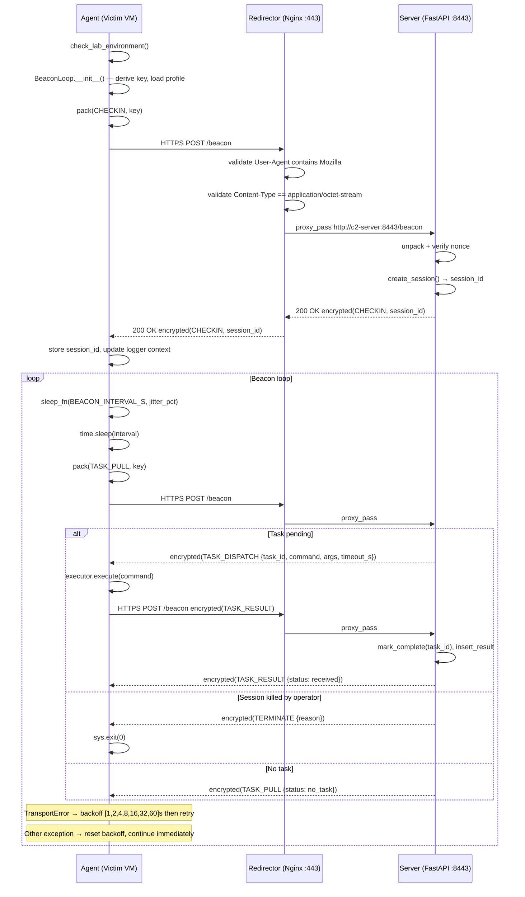
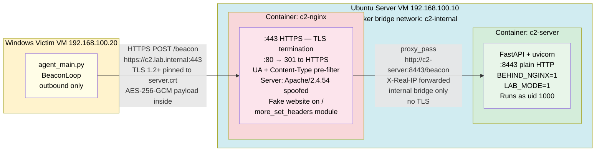
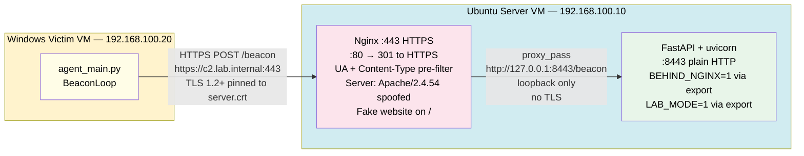

# Architecture — C2 Simulation Framework

## Section 1: Overview

The C2 Simulation Framework is a research-grade Command and Control system built to
demonstrate realistic implant-to-controller communication within a fully isolated lab
network. It implements a pull-based beacon model in which a Windows victim agent
periodically contacts an Ubuntu server through an Nginx reverse proxy, retrieving
commands and returning results over an AES-256-GCM encrypted, TLS-wrapped channel.
The framework includes a configurable evasion layer — sleep jitter, traffic padding,
and HTTP header randomisation — whose effect on network traffic is captured as
structured telemetry for future ML-based NIDS. All operations are hard-gated to
the lab environment: the agent will not start, connect, or execute outside the defined
lab network.

---

## Section 2: Component Table

| Layer | Component | File | Responsibility |
|---|---|---|---|
| **Agent** | Entry point | `agent/agent_main.py` | Environment gate → BeaconLoop startup; catastrophic error handler |
| **Agent** | Environment gate | `agent/environment_checks.py` | Validates `LAB_MODE=1` and target host before any socket opens |
| **Agent** | Beacon loop | `agent/beacon.py` | CHECKIN → TASK_PULL → TASK_RESULT cycle; exponential back-off; TERMINATE handling |
| **Agent** | Executor | `agent/executor.py` | Runs subprocesses via `subprocess.run(shell=False)`; enforces `BLOCKED_COMMANDS`; returns `TaskResult` |
| **Agent** | Jitter | `agent/jitter.py` | Jitter calculation helper used by beacon loop |
| **Server** | Entry point | `server/server_main.py` | FastAPI app; `/beacon` POST handler; lifespan startup/shutdown; 404 catch-all |
| **Server** | Session manager | `server/session_manager.py` | In-memory session state with `asyncio.Lock`; create, get, update, deactivate |
| **Server** | Command queue | `server/command_queue.py` | Per-session async task queue; enqueue, peek, mark dispatched/complete |
| **Server** | Storage | `server/storage.py` | SQLite persistence via `aiosqlite`; sessions, tasks, results, nonces tables |
| **Server** | Operator CLI | `server/api_interface.py` | Operator-facing interface for list/task/results/kill commands |
| **Transport** | HTTP transport | `transport/http_transport.py` | `send_beacon()`: host validation, TLS-pinned session, header injection, error mapping |
| **Transport** | TLS wrapper | `transport/tls_wrapper.py` | Builds `ssl.SSLContext` pinned to lab cert; TLS 1.2 minimum; logs SHA-256 fingerprint |
| **Transport** | Traffic profile | `transport/traffic_profile.py` | Loads active evasion profile from `profile_config.yaml`; exposes `header_level`, `jitter_pct`, `jitter_strategy` |
| **Evasion** | Sleep strategy | `evasion/sleep_strat.py` | `uniform_sleep` and `gaussian_sleep`; `get_sleep_fn()` factory; `MIN_SLEEP_S` floor |
| **Evasion** | Padding strategy | `evasion/padding_strat.py` | Prepends 2-byte length prefix; appends random bytes; `strip_padding()` reverses |
| **Evasion** | Header randomiser | `evasion/header_randomizer.py` | Four-level header pool rotation; `Host` and `Content-Type` always fixed and first |
| **Evasion** | Profile config | `evasion/profile_config.yaml` | Named profiles: baseline, low, medium, high; `active_profile` selects at runtime |
| **Common** | Config | `common/config.py` | All runtime constants: hosts, ports, PSK, intervals, blocked commands |
| **Common** | Crypto | `common/crypto.py` | `encrypt`, `decrypt` (AES-256-GCM); `derive_key` (HKDF-SHA256); `get_session_key` |
| **Common** | Message format | `common/message_format.py` | `pack` / `unpack`: JSON → encrypt → binary envelope; magic bytes `0xC2C2` |
| **Common** | Logger | `common/logger.py` | Structured JSON logger; stdout + rotating file; `update_session` injects session ID |
| **Common** | Utils | `common/utils.py` | Exception hierarchy: `C2Error`, `CryptoError`, `ProtocolError`, `TransportError`, `EnvironmentError` |
| **Redirector** | Nginx | `redirector/nginx_docker.conf` | TLS termination on 443; pre-filters UA and Content-Type; proxies `/beacon` to backend; serves fake site on `/` |
| **Telemetry** | PCAP capture | `telemetry/traffic_capture.py` | Wraps tcpdump/scapy; start/stop capture; labels files by experiment config |
| **Telemetry** | Flow parser | `telemetry/flow_parser.py` | PCAP → `FlowRecord` list; inter-arrival times, byte counts |
| **Telemetry** | Feature extractor | `telemetry/feature_extractor.py` | Per-flow: mean/std IAT, Shannon entropy, payload length statistics |

---

## Section 3: Beacon Cycle Sequence Diagram

The following diagram shows the complete beacon cycle as implemented. `MSG_TERMINATE`
is an addition beyond the original four message types in the spec — it is sent by the
server when an operator kills a session, causing the agent to exit cleanly on its
next `TASK_PULL`.



---

## Section 4: Data Flow Diagram

This section traces exactly where plaintext, padded bytes, ciphertext, and
TLS-wrapped bytes exist at each step of a single outbound beacon. The two encryption
layers — AES-256-GCM at the application layer and TLS at the transport layer — are
independent and serve different purposes.

```mermaid
flowchart TD
    A["① Plaintext JSON payload<br/>{msg_type, session_id, nonce, timestamp, payload}<br/>Exists in: agent memory only"]
    B["② Padded plaintext<br/>pad() prepends 2-byte length prefix<br/>Appends 0–N random bytes before encryption<br/>Profile-dependent: baseline = 0 bytes added<br/>Exists in: agent memory only"]
    C["③ AES-256-GCM encrypted body<br/>AEAD: ciphertext + 16-byte auth tag<br/>12-byte random nonce prepended<br/>Key = HKDF-SHA256(PSK, fixed salt)<br/>Exists in: agent memory only"]
    D["④ Framed binary envelope<br/>Header: magic(0xC2C2) + version(0x01) + length(4 bytes)<br/>Body: nonce(12 bytes) + ciphertext+tag(variable)<br/>Exists in: agent memory only"]
    E["⑤ TLS record — wire<br/>Entire HTTP POST wrapped by TLS 1.2 or 1.3<br/>Nginx presents server.crt<br/>Agent verifies against pinned cert via SSLContext<br/>Exists on network wire — fully encrypted"]
    F["⑥ Nginx — after TLS termination<br/>Decrypts TLS, sees raw HTTP POST<br/>Validates User-Agent and Content-Type<br/>Forwards binary body unchanged to FastAPI<br/>Nginx never sees plaintext payload<br/>Exists on c2-internal bridge as plain HTTP"]
    G["⑦ FastAPI — payload recovered<br/>unpack(): validates magic bytes + version<br/>Checks nonce against DB — rejects replays<br/>AEAD decryption verifies auth tag<br/>strip_padding() removes prefix and pad bytes<br/>Plaintext JSON payload available in server memory"]

    A --> B
    B --> C
    C --> D
    D --> E
    E --> F
    F --> G

    style A fill:#d4edda,color:#000000
    style B fill:#d4edda,color:#000000
    style C fill:#f8d7da,color:#000000
    style D fill:#f8d7da,color:#000000
    style E fill:#d1ecf1,color:#000000
    style F fill:#fff3cd,color:#000000
    style G fill:#d4edda,color:#000000
```



**Legend:**
- 🟢 Green — plaintext exists in process memory only
- 🔴 Red — AES-256-GCM ciphertext; auth tag provides tamper detection
- 🔵 Blue — TLS record on the wire; payload is double-encrypted at this point
- 🟡 Yellow — plain HTTP on the internal bridge; binary body is still AES-GCM encrypted

**Critical point:** Nginx decrypts the outer TLS layer but never has access to the
plaintext payload. The AES-256-GCM layer is end-to-end between the agent process and
the FastAPI process. A compromised redirector can observe packet timing and sizes but
cannot read payload content.

---

## Section 5: Network Topology

### Docker Deployment (Recommended)



### Bare-Metal Deployment



### Deployment Comparison

| Aspect | Docker | Bare-Metal |
|---|---|---|
| Nginx → FastAPI | `http://c2-server:8443` (bridge DNS) | `http://127.0.0.1:8443` (loopback) |
| Server header suppression | `more_clear_headers` + `more_set_headers` (unconditional) | `proxy_hide_header` + `add_header` |
| TLS cert path in Nginx | `/etc/nginx/certs/server.{crt,key}` | `/home/c2server/c2-framework/certs/` |
| `LAB_MODE` + `BEHIND_NGINX` | Set automatically by Compose | Set manually via `export` |
| Log persistence | Mounted volume `./logs` | Filesystem on VM |
| Start order enforced | `depends_on: c2-server` | Manual — server must start before Nginx |

### Nginx Pre-Filter Chain

Before any request reaches FastAPI, Nginx enforces the following checks in order.
A request failing any check is dropped at Nginx and FastAPI never sees it.

```
POST /beacon received on :443
        │
        ▼
┌──────────────────────────────┐
│ TLS handshake                │ Fail → connection rejected
│ server.crt presented         │
└──────────────┬───────────────┘
               │
        ▼
┌──────────────────────────────┐
│ method == POST?              │ Fail → deny all (limit_except)
└──────────────┬───────────────┘
               │
        ▼
┌──────────────────────────────┐
│ User-Agent contains Mozilla? │ Fail → 404
│ (case-insensitive in Docker) │
└──────────────┬───────────────┘
               │
        ▼
┌──────────────────────────────┐
│ Content-Type ==              │ Fail → 404
│ application/octet-stream?    │
└──────────────┬───────────────┘
               │
        ▼
┌──────────────────────────────┐
│ proxy_pass → FastAPI :8443   │
│ X-Real-IP forwarded          │
│ client_max_body_size 256k    │
└──────────────────────────────┘
```

Non-beacon paths (`/`, `/admin`, etc.) are served by the fake static site or return
404. The server never presents itself as Nginx — all responses carry
`Server: Apache/2.4.54`.

---

## Section 6: Language Decision Rationale

### Why Python

The framework is implemented entirely in Python 3.11 for the following reasons.

**Development speed and library ecosystem.** The full cryptography stack (PyCA
`cryptography`), async server (`FastAPI` + `uvicorn`), synchronous HTTP client
(`requests`), async SQLite (`aiosqlite`), and PCAP parsing (`scapy`) are all mature,
audited Python libraries. Using them eliminates the need to implement or integrate
any of these subsystems from scratch. 

**Correctness of cryptographic primitives.** The PyCA `cryptography` library wraps
OpenSSL and is the library recommended by Python's own documentation for production
cryptographic work. Writing equivalent AES-256-GCM + HKDF primitives in C++ would
require either reimplementing them — with high risk of subtle error in GCM tag
handling or HKDF salt application — or linking OpenSSL directly, which provides
equivalent security at significantly greater integration complexity.

**Research legibility.** Python source maps directly to the specification, runs without
a compilation step, and the complete test suite executes with a single `pytest`
command. Legibility and reproducibility are explicit project goals.

**The lab environment is controlled.** Performance constraints that would motivate a
rewrite — microsecond timing requirements, kernel-level integration, constrained
memory targets — do not apply inside a two-VM isolated lab network with a 30-second
beacon interval. Python's interpreter overhead is irrelevant at that scale.

### What a C++ Rewrite of the Agent Would Change

A C++ implementation applies to the agent specifically. The server, evasion layer,
telemetry pipeline, and redirector would remain Python and Nginx regardless.

**Reduced memory footprint.** A compiled binary carries no Python interpreter
overhead. This matters for implants on embedded or memory-constrained targets, not
for a lab VM running Windows 10.

**Native Windows API access.** A C++ agent calls `IsDebuggerPresent`,
`NtQueryInformationProcess`, and CPUID checks natively. The current
`environment_checks.py` uses `ctypes` for these calls, which is correct but more
fragile than native linkage — a future Windows API change could break the `ctypes`
bindings silently.

**No Python runtime dependency on victim.** The current agent requires Python 3.11
installed on the Windows VM, which is satisfied as a lab prerequisite. A compiled
binary requires nothing beyond the Windows CRT, which every Windows install already
has.

**Compilation as obfuscation.** A compiled binary is harder to static-analyse than a
`.py` file. For this research demo the source is intentionally public, so this is
irrelevant. For a real red team engagement it would matter significantly.

**What would not change.** The wire protocol, crypto spec, message envelope format,
and evasion profile parameters are all language-agnostic. A C++ agent using the same
AES-256-GCM envelope and HKDF key derivation would be fully interoperable with the
existing Python FastAPI server without any server-side modification.

---

## Appendix A: Evasion Profile Reference

| Profile | Strategy | Jitter % | Pad Min | Pad Max | Header Level | Intended Use |
|---|---|---|---|---|---|---|
| baseline | uniform | 0% | 0 B | 0 B | 0 — fixed headers | Control condition — fully deterministic |
| low | uniform | 10% | 0 B | 64 B | 1 — UA rotation | Minimal evasion |
| medium | uniform | 20% | 0 B | 128 B | 2 — UA + language | Moderate evasion — **active profile** |
| high | gaussian | 40% | 64 B | 256 B | 3 — full shuffle | Maximum evasion |

`high` is the only profile using gaussian jitter, which produces occasional large
deviations that make inter-arrival time analysis significantly harder than the uniform
distribution used by other profiles. All other profiles use uniform jitter, where the
sleep interval is drawn from `uniform(base*(1-pct), base*(1+pct))` and clamped to a
minimum of 1.0 second.

---

## Appendix B: Exception Hierarchy

All framework errors derive from `C2Error`, allowing the beacon loop to handle any
framework failure with a single `except C2Error` clause without risking suppression
of unrelated Python runtime errors.

```
C2Error                           — base; caught by beacon loop in beacon.py
├── CryptoError                   — common/crypto.py
│                                   AES-GCM tag failure, wrong key/nonce length
├── ProtocolError                 — common/message_format.py
│                                   Bad magic bytes, truncated envelope, invalid JSON
├── TransportError(status_code)   — transport/http_transport.py
│                                   Connection errors, timeouts, HTTP 4xx/5xx
│                                   status_code kwarg preserves HTTP status for callers
└── EnvironmentError              — agent/environment_checks.py
                                    LAB_MODE not set, host not in ALLOWED_HOSTS
```

`EnvironmentError` intentionally shadows the Python built-in `EnvironmentError`
(an alias for `OSError`) within the framework namespace. This is not a bug — the
framework always imports from `common.utils` explicitly and never relies on the
built-in name. The choice was made to give the lab gate failure its own typed
exception consistent with the rest of the hierarchy.